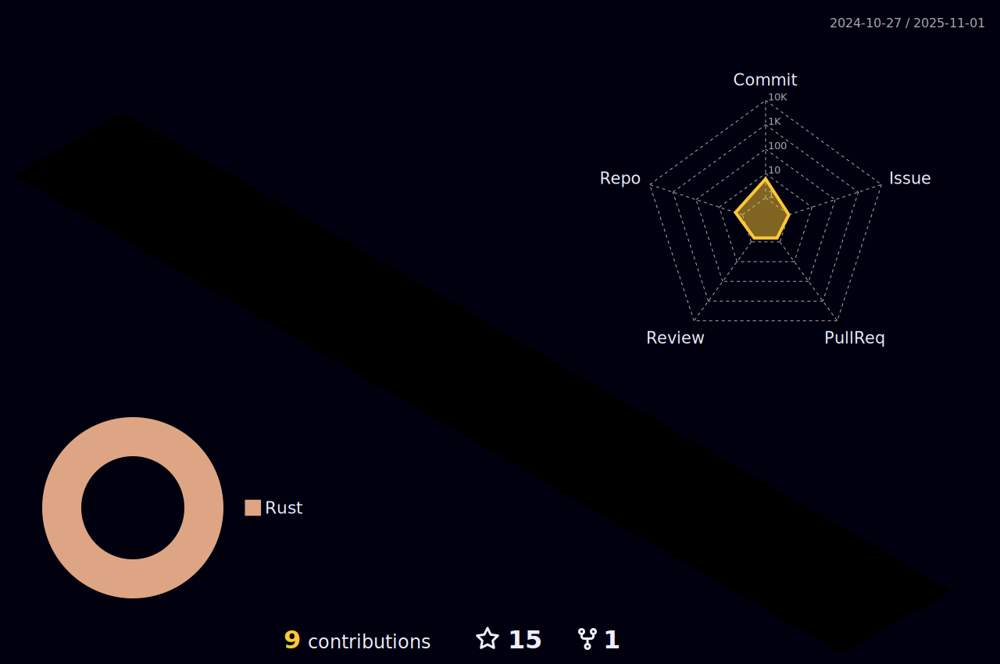

 

 
 

 
 
 
 

### Here are some fun facts about me:

- 💻 I enjoy solving complex problems and fixing technical issues.
- 🚀 I’m currently working as A Full-Stack nodejs freelancer.
- 👥 I’m looking to collaborate with people with Amazing Ideas.
   

## 📩 Connect with me

 
 
 

 
 

  

  
  
  

#

**𝙻𝙰𝙽𝙶𝚄𝙰𝙶𝙴𝚂 𝙰𝙽𝙳 𝚃𝙾𝙾𝙻𝚂:**

 

 

 

**Languages**
<code></code>
<code></code>
 

**Code control**
<code></code>
<code></code>
<code></code>
 

**Databases-Cache**
<code></code>
<code></code>
<code></code>
<code></code>
<code></code>
<code></code>
<code></code>
 

**Frameworks**
<code></code>
<code></code>
<code></code>
<code></code>
 

**APIS**
<code></code>
<code></code>
<code></code>

 

**Some Other Tools**

<code></code>
<code></code>
<code></code>
<code></code>
<code></code>
<code></code>
<code></code>
<code></code>
<code></code>

#

 

#

 

 
 
 
 
 
 

**GITHUB STATS :**

<!--  -->

